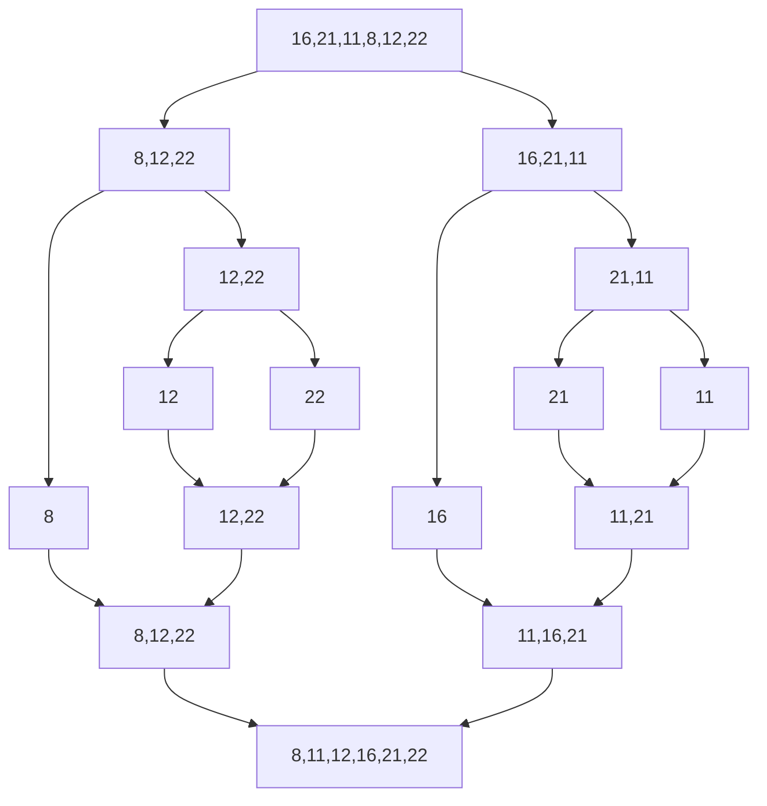

[16,21,11,8,12,22] -> Merge Sort

```mermaid
graph TD;
    A[16,21,11,8,12,22]-->B[16,21,11];
    A-->C[8,12,22];
    B-->D[16];
    B-->E[21,11];
    C-->F[8];
    C-->G[12,22];
    E-->H[21];
    E-->I[11];
    G-->J[12];
    G-->K[22];
    J-->L[12,22];
    K-->L[12,22];
    F[8]-->M[8,12,22];
    L[12,22]-->M[8,12,22];
    H[21]-->N[11,21];
    I[11]-->N[11,21];
    D[16]-->O[11,16,21];
    N[11,21]-->O[11,16,21];
    M[8,12,22]-->P[8,11,12,21,22];
    O[11,16,21]-->P[8,11,12,16,21,22];    
```

 

[Alparslan KELCİ](https://github.com/AlparslanKelci "My github repository")

 

* Created with Markdown syntax & Mermaid Graphs